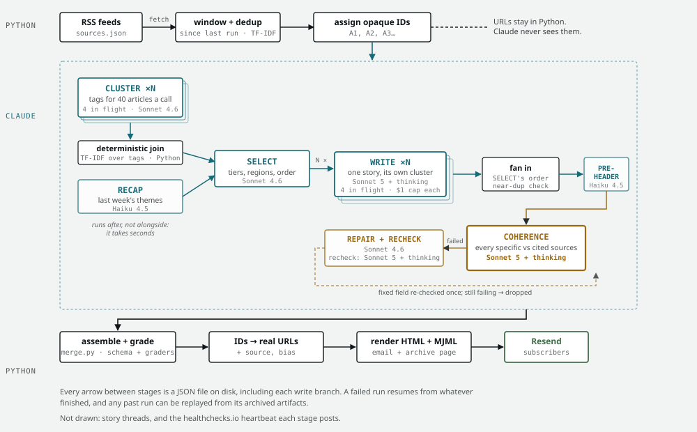

# News Digest

A transparent, self-hostable AI news desk you run yourself. Every morning it reads 37 feeds across five continents, clusters the day's stories, decides what matters, writes a bias-labelled briefing, fact-checks its own work, and emails it -- no human edits any issue. Clone it and run your own for a few dollars a day, or read the [live instance](https://news-digest.seanfloyd.dev).

Every choice it makes is inspectable: real [subscriber and cost numbers](https://news-digest.seanfloyd.dev/stats), every source [labelled by political bias and factuality](https://news-digest.seanfloyd.dev/sources), and the code that does it all right here.

## What makes it different

- **Fully autonomous.** No human writes, edits, or approves any issue. The pipeline fetches, curates, writes, and fact-checks itself, then sends.
- **Claude never sees a URL.** Python assigns opaque article IDs (`A1`, `A2`, ...) and the model curates and writes referencing only those IDs; Python resolves them back to sources afterward. Curation can't be swayed by domain, and a malicious feed can't inject a link into the output.
- **Five specialized subagents, deterministically orchestrated.** `CLUSTER -> RECAP -> SELECT -> WRITE -> COHERENCE`, each a file-based Claude Agent SDK subagent that reads and writes JSON, run in a fixed order by Python so the parent context stays small and the run is reproducible.
- **It fact-checks itself, then repairs itself.** A `COHERENCE` pass re-reads every headline and summary against its source articles. Anything that fails is first regenerated from its own cited sources, changing as little as possible, and re-checked; only what still fails is dropped, before send rather than after. Every attempt is recorded to `repair_log.jsonl`.
- **Cheap clustering by design.** Grouping is a deterministic extract-then-join (entities + event + time per article, then a join), not a holistic LLM pass over everything. Lower cost, less drift.
- **Evolving story threads.** Ongoing stories are tracked across days, so a returning reader sees what changed rather than a fresh fragment.
- **Radical transparency.** A public [stats page](https://news-digest.seanfloyd.dev/stats) shows real subscriber numbers, source balance across the political spectrum, and the AI cost per issue. Every source is [labelled by bias and factuality](https://news-digest.seanfloyd.dev/sources), and the code is right here.

## What an issue looks like

[](https://news-digest.seanfloyd.dev/today)

Each story carries a headline, a summary, a why-it-matters note, how the reporting varies across outlets, and the political balance of its sources. [See today's issue](https://news-digest.seanfloyd.dev/today).

## Architecture

Two components:

- **newsroom** — the Python pipeline: `fetch -> cluster -> recap -> select -> write (one call per story) -> preheader -> coherence -> repair -> assemble -> render -> email`. Stages hand off through JSON files on disk rather than a shared context, so a crashed run resumes and any past run can be replayed from its archived artifacts. Sonnet 5 with adaptive thinking writes and fact-checks; Sonnet 4.6 clusters, selects and repairs; Haiku writes the recap and the inbox preview line.
- **circulation** — a Rust (Axum) web server: the online archive, per-issue pages, the sources and stats pages, story threads, and the "view in browser" links.

<!-- pipeline-anatomy:begin -->
<picture>
  <source media="(prefers-color-scheme: dark)" srcset="docs/pipeline-anatomy-dark.svg">
  
</picture>

<sub>Stages and models as of 8344c58. Run figures from run 284 (2026-09-02). That run wrote all stories in one call; the per-story WRITE drawn here had not yet run. Regenerate with `make anatomy`. Per-stage models and costs: `docs/pipeline-anatomy.html`.</sub>
<!-- pipeline-anatomy:end -->

## Quick Start

### Prerequisites

- Docker
- A Claude subscription (Max or Pro) or [API key](https://console.anthropic.com/)
- [Resend](https://resend.com) account (free tier: unlimited broadcasts to 1,000 contacts)

### 1. Clone and configure

```bash
git clone https://github.com/SeanLF/claude-rss-news-digest.git
cd claude-rss-news-digest
cp .env.example .env
```

Edit `.env` with your settings. The required values are:

```bash
# Claude authentication (choose one):
CLAUDE_CODE_OAUTH_TOKEN=sk-ant-oat01-...   # Subscription: `claude setup-token`
# ANTHROPIC_API_KEY=sk-ant-...              # Pay-per-use: console.anthropic.com

# Resend (https://resend.com)
RESEND_API_KEY=re_xxxxxxxx_xxxxxxxxxxxxxxxxxxxx
RESEND_FROM=onboarding@resend.dev
RESEND_AUDIENCE_ID=xxxxxxxx-xxxx-xxxx-xxxx-xxxxxxxxxxxx
```

See `.env.example` for optional settings (digest name, author, archive URL, etc).

### 2. Run

```bash
# Test run: fetches articles, generates digest, skips email
docker compose run --rm digest-newsroom --dry-run

# Full run: fetch, curate, email, record
docker compose run --rm digest-newsroom
```

The database is created automatically on first run.

### 3. Schedule (optional)

```bash
# Daily at 07:00 UTC
0 7 * * * cd /path/to/news-digest && docker compose run --rm digest-newsroom >> data/cron.log 2>&1
```

### 4. Web archive (optional)

```bash
make dev-import        # imports a copy of the prod clone into the dev stack's Postgres, then starts the stack
# Browse at http://localhost:8080 or http://digest-site.news-digest.orb.local:8080; dev mail at :8025
docker compose up -d digest-circulation   # the Rust server it replaces, on :8081 until the cut-over
```

## Sources

37 feeds from 30 outlets across five continents, spanning the political spectrum. Bias, factual reporting and credibility are taken from [Media Bias/Fact Check](https://mediabiasfactcheck.com), read per outlet so each rating traces to one published assessment; 26 of 37 feeds rate High or Very High for factual reporting, 10 Mostly Factual or Mixed, and one (Hacker News) is unrated. Every source is shown with its bias and factuality on the live [sources page](https://news-digest.seanfloyd.dev/sources). See [`newsroom/sources.json`](newsroom/sources.json) for the full list.

## Cost

Roughly a few dollars a day in API-equivalent cost (Sonnet for the reasoning stages, Haiku for recap). The live [stats page](https://news-digest.seanfloyd.dev/stats) shows the current per-issue number.

## Troubleshooting

| Problem | Fix |
|---------|-----|
| No digest generated | Check `data/digest.log`; verify auth with `docker compose run --rm digest-newsroom claude --version` |
| Email not sending | Verify `RESEND_API_KEY` and `RESEND_FROM` in `.env`; test with `docker compose run --rm digest-newsroom --test-email you@example.com` |
| Container issues | `docker compose build --no-cache` |

## The Temporal pipeline: what we know, and what we don't yet

The pipeline is being rewritten in TypeScript on Temporal, in `digest/` ([spec](docs/superpowers/specs/2026-09-21-four-systems-rewrite-design.md)). Python still sends every issue. Staging, cut-over, rollback and day to day: the [runbook](docs/2026-09-23-temporal-cutover-runbook.md).

**Verified, locally:**

- **End to end, up to the hold** on Postgres through Temporal, real model calls, one fresh day: 16 stories. The worker was killed mid-WRITE; the resume re-ran only the 11 missing branches and duplicated nothing. [`docs/proposed/2026-09-23-e2e-postgres`](docs/proposed/2026-09-23-e2e-postgres/README.md)
- **Through the send on the dev stack**: hold, approve, a broadcast caught by resend-fake, and the issue served by the TypeScript site from the same Postgres, with thread badges. Nothing delivered for real. [`docs/proposed/2026-09-24-dev-stack-send`](docs/proposed/2026-09-24-dev-stack-send/README.md)
- **Import** of the prod clone into Postgres: 15 tables match the file, all 16 row checks pass, each negative-controlled. [Data model §5](docs/2026-09-23-data-model-design.md), `make import-check`
- **Threads** against the Python oracle: 5 of 5 runs (300-304) equal, once the intended schema changes are mapped. Merges and retraction are covered by unit tests only. [`docs/proposed/2026-09-23-threads-parity-postgres`](docs/proposed/2026-09-23-threads-parity-postgres/README.md)
- **Site** against the Rust server: 138 of 144 requests equal; the other 6 are known divergences, 0 unexplained. Search tuned separately. [Fork doc §7](docs/2026-09-23-web-tier-typescript-fork.md), [`docs/proposed/2026-09-23-search-tuning`](docs/proposed/2026-09-23-search-tuning/README.md)
- **Day 305, side by side with production** on the same archived fetch: $5.09 against $5.77 (12% lower, inside the old system's own same-day band of $4.36-6.08, [`docs/proposed/2026-09-22-same-day-band`](docs/proposed/2026-09-22-same-day-band/README.md)), 15 stories against 17, no quality difference two judge families could detect. One day of the three the gate needs, with no planted defects (spec §7). [`docs/proposed/gate-fixtures/day-305`](docs/proposed/gate-fixtures/day-305/README.md)
- **Deploy race** (a build made current before the server had registered it; 1 in 8 CI runs): fixed in 57a647d, held by `digest/src/deployment.test.ts`. The 20 of 20 clean runs under load after it are from the session, not recorded in the repo.

**Not run anywhere real:**

- **Nothing has run on the box.** Every unit, script and the worker itself ran in local rehearsals only. [Runbook, "Unverified until the first apply"](docs/2026-09-23-temporal-cutover-runbook.md#unverified-until-the-first-apply)
- **The terraform apply** for `staged` or `temporal` (branch `digest-temporal` of seanfloyd.dev) has never run.
- **Memory on the 4 GB box.** The temporal-mode caps sum to 2752 of 2825 MiB free. The worker's 1280 MiB cap rests on a per-process estimate; a four-way WRITE under it is unmeasured. `staged` puts about 560 MiB beside Python's run, which is capped at 2 GiB. The Node site's 256 MiB cap (fork doc §8) is not in that sum and exceeds the 73 MiB left; it fits only if the Rust server it replaces frees at least as much, which nobody has measured. [Runbook, "Memory budget"](docs/2026-09-23-temporal-cutover-runbook.md#memory-budget-temporal)
- **A real send from the TypeScript side**, and `RESEND_LIVE=true` on the box. Without it the worker refuses real Resend (no send, no alert, no hold notice), and the web container refuses to start with subscriptions on. [Runbook, "What is on the box"](docs/2026-09-23-temporal-cutover-runbook.md#what-is-on-the-box-staged-and-temporal), fork doc §8
- **healthchecks.io timing.** The success ping moves to the send, 15 minutes later on a held day, and an hour earlier from 2026-10-25 (the schedule is fixed at 10:25Z; Python's timer follows Paris). The check's schedule and grace are unchecked. [Runbook, "Before the cut-over"](docs/2026-09-23-temporal-cutover-runbook.md#before-the-cut-over)
- **Rollback double-sends.** Python cannot see what Temporal sent, and the re-enabled timer may catch up at once; a rollback on a day Temporal sent can send twice. The catch-up after days disabled is untested. [Runbook, "Rollback"](docs/2026-09-23-temporal-cutover-runbook.md#rollback-temporal---python-or-staged)
- **Rollback of the site.** The runbook's rollback does not cover it. The Rust server reads `digest.db`, which has no Temporal-era issue, and a rollback is clean only until the first TypeScript run writes. [Data model §5, step 4](docs/2026-09-23-data-model-design.md)
- **Planted defects** (spec §7, item 1) on any gate day. Day 305 rests on judges alone.
- **Content quality the checks miss.** The pre-send checks catch leaked ids, empty fields, story counts, fact-check drops and unaudited thread facts ([`digest/src/ops/pre-send.ts`](digest/src/ops/pre-send.ts)). A poor selection, a weak summary or a claim COHERENCE passed goes out.

**Rollout order.** Steps 2 and 4 are not in the runbook yet.

1. `staged`: the stack on the box, the worker on a scratch copy with broadcast off. Python still sends.
2. The TypeScript site on a preview host. Which database it reads is open: `digest` is empty until the cut-over's import, and staged writes `digest_staged`.
3. Three gate days, each TypeScript issue compared with Python's for the same day (spec §7).
4. A dress rehearsal of the cut-over and the rollback on `staged`, broadcast off. How to rehearse the switch without making it is not written down.
5. Cut-over with `HOLD_ALWAYS_THROUGH` set: every issue holds 15 minutes for approve or reject for the first days, then the setting lapses on its own.
6. Keep `digest.db` and the last Python deploy tag until a quiet week on Temporal. After the first TypeScript run they are a fallback, not a lossless rollback.

## More

- **Production deployment** -- [docs/DEPLOYMENT.md](docs/DEPLOYMENT.md)
- **Architecture and dev context** -- [CLAUDE.md](CLAUDE.md)
- **All CLI flags** -- `docker compose run --rm digest-newsroom --help`

## License

[PolyForm Noncommercial License 1.0.0](LICENSE) -- free to use, modify, and share
for any noncommercial purpose (personal, research, education, nonprofits). Commercial
use, including by for-profit organizations, is not permitted. This is a
source-available licence, not an OSI open-source one.
