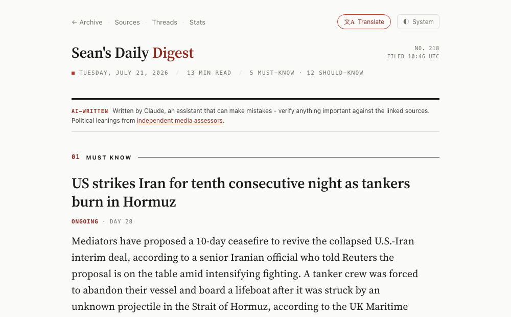

# News Digest

A transparent, self-hostable AI news desk you run yourself. Every morning it reads 35 feeds across five continents, clusters the day's stories, decides what matters, writes a bias-labelled briefing, fact-checks its own work, and emails it -- no human edits any issue. Clone it and run your own for a few dollars a day, or read the [live instance](https://news-digest.seanfloyd.dev).

Every choice it makes is inspectable: real [subscriber and cost numbers](https://news-digest.seanfloyd.dev/stats), every source [labelled by political bias and factuality](https://news-digest.seanfloyd.dev/sources), and the code that does it all right here.

## What makes it different

- **Fully autonomous.** No human writes, edits, or approves any issue. The pipeline fetches, curates, writes, and fact-checks itself, then sends.
- **Claude never sees a URL.** Python assigns opaque article IDs (`A1`, `A2`, ...) and the model curates and writes referencing only those IDs; Python resolves them back to sources afterward. Curation can't be swayed by domain, and a malicious feed can't inject a link into the output.
- **Five specialized subagents, deterministically orchestrated.** `CLUSTER -> RECAP -> SELECT -> WRITE -> COHERENCE`, each a file-based Claude Agent SDK subagent that reads and writes JSON, run in a fixed order by Python so the parent context stays small and the run is reproducible.
- **It fact-checks itself.** A final `COHERENCE` pass re-reads every headline and summary against its source articles; anything that fails is dropped before send, not after.
- **Cheap clustering by design.** Grouping is a deterministic extract-then-join (entities + event + time per article, then a join), not a holistic LLM pass over everything. Lower cost, less drift.
- **Evolving story threads.** Ongoing stories are tracked across days, so a returning reader sees what changed rather than a fresh fragment.
- **Radical transparency.** A public [stats page](https://news-digest.seanfloyd.dev/stats) shows real subscriber numbers, source balance across the political spectrum, and the AI cost per issue. Every source is [labelled by bias and factuality](https://news-digest.seanfloyd.dev/sources), and the code is right here.

## What an issue looks like

[](https://news-digest.seanfloyd.dev/today)

Each story carries a headline, a summary, a why-it-matters note, how the reporting varies across outlets, and the political balance of its sources. [See today's issue](https://news-digest.seanfloyd.dev/today).

## Architecture

Two components:

- **newsroom** — the Python pipeline: `fetch -> cluster -> recap -> select -> write -> coherence -> assemble -> render -> email`. Subagents hand off through JSON files on disk rather than a shared context. Claude (Sonnet) does the reasoning; the cheap recap stage runs on Haiku.
- **circulation** — a Rust (Axum) web server: the online archive, per-issue pages, the sources and stats pages, story threads, and the "view in browser" links.

```
RSS feeds ->  fetch  ->  CLUSTER   group articles into stories (extract -> join)
                         RECAP     summarise the week's titles (Haiku)
                         SELECT    editorial judgment: tiers, regions, what matters
                         WRITE     headlines, summaries, why-it-matters (IDs only)
                         COHERENCE fact-check every claim vs its source; drop failures
                     ->  assemble (Python resolves IDs -> URLs/source/bias)
                     ->  render HTML  ->  email (Resend)  +  web archive (circulation)
```

## Quick Start

### Prerequisites

- Docker
- A Claude subscription (Max or Pro) or [API key](https://console.anthropic.com/)
- [Resend](https://resend.com) account (free tier: unlimited broadcasts to 1,000 contacts)

### 1. Clone and configure

```bash
git clone https://github.com/SeanLF/claude-rss-news-digest.git
cd claude-rss-news-digest
cp .env.example .env
```

Edit `.env` with your settings. The required values are:

```bash
# Claude authentication (choose one):
CLAUDE_CODE_OAUTH_TOKEN=sk-ant-oat01-...   # Subscription: `claude setup-token`
# ANTHROPIC_API_KEY=sk-ant-...              # Pay-per-use: console.anthropic.com

# Resend (https://resend.com)
RESEND_API_KEY=re_xxxxxxxx_xxxxxxxxxxxxxxxxxxxx
RESEND_FROM=onboarding@resend.dev
RESEND_AUDIENCE_ID=xxxxxxxx-xxxx-xxxx-xxxx-xxxxxxxxxxxx
```

See `.env.example` for optional settings (digest name, author, archive URL, etc).

### 2. Run

```bash
# Test run: fetches articles, generates digest, skips email
docker compose run --rm digest-newsroom --dry-run

# Full run: fetch, curate, email, record
docker compose run --rm digest-newsroom
```

The database is created automatically on first run.

### 3. Schedule (optional)

```bash
# Daily at 07:00 UTC
0 7 * * * cd /path/to/news-digest && docker compose run --rm digest-newsroom >> data/cron.log 2>&1
```

### 4. Web archive (optional)

```bash
docker compose up -d digest-circulation
# Browse at http://localhost:8080
```

## Sources

35 sources across five continents, weighted toward high-factuality outlets and spanning the political spectrum. Bias is rated on the [Ground News](https://ground.news/) 7-point scale, and every source is shown with its bias and factuality on the live [sources page](https://news-digest.seanfloyd.dev/sources). See [`newsroom/sources.json`](newsroom/sources.json) for the full list.

## Cost

Roughly a few dollars a day in API-equivalent cost (Sonnet for the reasoning stages, Haiku for recap). The live [stats page](https://news-digest.seanfloyd.dev/stats) shows the current per-issue number.

## Troubleshooting

| Problem | Fix |
|---------|-----|
| No digest generated | Check `data/digest.log`; verify auth with `docker compose run --rm digest-newsroom claude --version` |
| Email not sending | Verify `RESEND_API_KEY` and `RESEND_FROM` in `.env`; test with `docker compose run --rm digest-newsroom --test-email you@example.com` |
| Container issues | `docker compose build --no-cache` |

## More

- **Production deployment** -- [docs/DEPLOYMENT.md](docs/DEPLOYMENT.md)
- **Architecture and dev context** -- [CLAUDE.md](CLAUDE.md)
- **All CLI flags** -- `docker compose run --rm digest-newsroom --help`

## License

[PolyForm Noncommercial License 1.0.0](LICENSE) -- free to use, modify, and share
for any noncommercial purpose (personal, research, education, nonprofits). Commercial
use, including by for-profit organizations, is not permitted. This is a
source-available licence, not an OSI open-source one.
